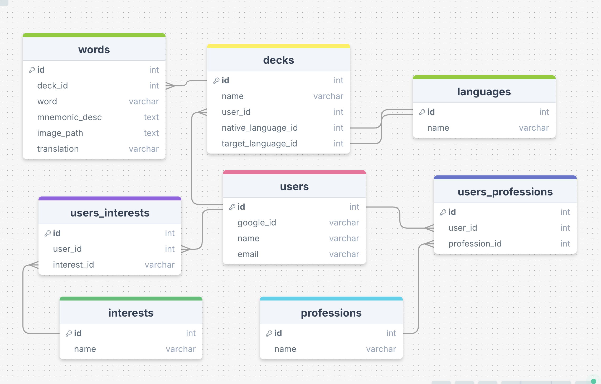

# Mnema Project Proposal

## Overview

Mnema is an app that helps language learners create personalized mnemonics to enhance memory retention. It combines words and images, packaging them into a format convenient for use in Anki.

### Problem

People learning a new language from scratch face several challenges.

First, they need to memorize hundreds of new words, so it's important to systematize the learning process. The flashcard method, where a card contains only the word and its translation, helps, but it could be improved.

Second, if the learning process feels boring or monotonous, our brain begins to resist—reducing concentration, causing fatigue, or creating a desire to quit. Each time, it becomes increasingly harder to return to studying.

Finally, even memorized words are easily forgotten if they were not learned effectively or if they are not reviewed regularly.

### Solution

Mnema uses mnemonic techniques to create vivid visual images, which significantly enhances memory retention. Mnema personalizes images for each user based on their interests and preferences, making it easier to remember words by evoking strong emotional engagement.

Why it works:

**Visualization:** Vivid and detailed images stay in memory longer. Our brain is naturally tuned to process and store visual information, with visual images activating more memory-associated areas.

**Associations:** Our memory functions as a network, where new elements are anchored to existing connections. By linking new words to familiar knowledge, we create strong associative connections in the brain.

**Engagement:** Images tied to personal interests become more meaningful, making the learning process more emotionally charged. The brain perceives personalized information as important, leading to better retention.

### User Profile

Language learners:

1. Individuals at any level of language proficiency who want to improve their vocabulary.
2. Users who need an efficient method to quickly memorize and retain large amounts of vocabulary.
3. Those who prefer a visual learning approach and seek an engaging, interactive way to remember new words.


### Features

As a user, I want to understand the core mission of Mnema and start the process of learning quickly. 

As a new user, I want to log in using my Google account.

As a user, I want to choose the language I want to learn.

As a user, I want to select my native language from a list of options.

As a user, I want to specify my interests to personalize the learning experience.

As a user, I want to choose or enter my professions to further customize the learning content.

As a user, I want to have ability to change my native and target languages, my interests and professions.

As a user, I want to input words that I want to learn and generate translations, mnemonic descriptions and images for them.

As a user, I want to review the table with generated words, translations, and mnemonic descriptions. 

As a user, I can view the generated images and descriptions, and then download an Anki word list to continue learning offline.

As an admin I want to view all user profiles, edit and delete profiles.


### Tech Stack

**Frontend:**

- React for building the user interface
- JavaScript for client-side scripting
- Axios for making HTTP requests to the backend
- React-router for handling client-side routing and navigation

**Backend:**
- Node.js with Express for handling server-side logic and API requests
- Axios for making HTTP requests to GPT API
- MySQL for storing user data and preferences
- Knex.js for building SQL queries and managing database migrations
- [Openai](https://github.com/openai/openai-node) npm client package

**Authentication:**
-  Passport.js for managing authentication strategies. Users will log in using their Google accounts.

### APIs

OpenAI GPT-4 API: For generating mnemonic descriptions based on user input.
DALL-E API: For generating images to accompany mnemonic descriptions.

### Sitemap

Home Page: Introduction and navigation options.

Login Page: The user is redirected to Google for authorization and then returns to the site.

User Profile Page: Displays the user's name and email. Users can change their interests and professions.

Admin Page: Manage user profiles by viewing all profiles and deleting them.

Dashboard Page: Displays decks. Users can add and delete decks.

Deck Addition Page: Enter the deck name. Choose the language you speak and the language you want to learn.

Interests Selection Page: Select personal interests.

Profession Selection Page: Choose a profession.

Add Words Page: Input words for learning.

Results Page: Displays generated words, translations, and mnemonics.

Visuals & Download Page: Displays generated images and mnemonics, and provides a download option for the Anki word list.

# Data



### Auth

- Use Passport.js to handle authentication via Google OAuth.
- When a user logs in, they will be redirected to Google for authentication.
- Upon successful authentication, Google will return a token that Passport.js will use to create or update the user session.
- User information will be stored in the session, and no manual token management (like JWT) will be required.

## Installation and Setup

### Backend Setup

 The backend repository is available at [yulia-batrakova-mnema-server](https://github.com/batradev/yulia-batrakova-mnema-server). After cloning, copy the `.env.sample` file to `.env` and fill it with your environment variables (such as database credentials, API keys, etc.).

1. Navigate to the backend project directory:
   ```bash
   cd yulia-batrakova-mnema-server
   ```
   
2. Install the required dependencies:
   ```bash
   npm install
   ```
   
3. Start the backend server:
   ```bash
   npm start
   ```
   The backend will be accessible at `http://localhost:8080` by default.

### Frontend Setup

After cloning, copy the `.env.sample` file to `.env` and fill it with your environment variables.

1. Navigate to the frontend project directory:
   ```bash
   cd yulia-batrakova-brainflix
   ```

2. Install the dependencies:
   ```bash
   npm install
   ```

3. Start the frontend application:
   ```bash
   npm start
   ```

   The frontend will run at `http://localhost:3000`.

### Prerequisites

- Make sure the backend server is running before starting the frontend.
- Ensure that Node.js and npm are installed on your machine.

### API Configuration

If the backend server is running on a different port or URL, update the base API URL in the frontend code to match the running backend instance. By default, the frontend expects the backend to be running at `http://localhost:8080`.


## Planned Improvements

**Cloud Storage for Images**: Store generated images securely in cloud storage to ensure scalability and easy access.

**Add Download functionality**: Use Python with `genanki` to generate Anki packages (.csv/.apkg files). Create the `GET /api/download` endpoint in Express.

**Image Generation Optimization**: Generate images in batches and use background jobs to optimize cost and user experience (using OpenAI batch API).

**Implement email notifications** to notify users that their images are generated.
**Add Audio Pronunciation: Integrate text-to-speech API to provide pronunciation for each word in the user’s deck.

**Pre-built Decks**: Provide users with ready-made decks of flashcards on specific themes (e.g., travel, food, basic phrases). This allows users to start learning immediately without waiting for image generation.


