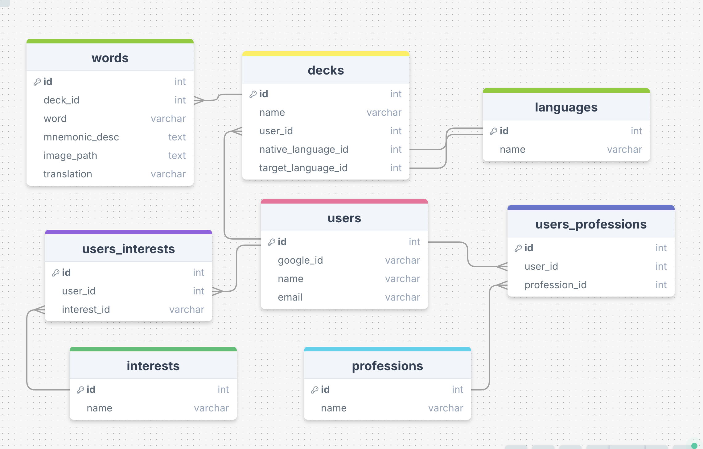

# Mnema Project Proposal

## Overview

Mnema is an app that helps language learners create personalized mnemonics to enhance memory retention. It combines words and images, packaging them into a format convenient for use in Anki.

### Problem

People learning a new language from scratch face several challenges.

First, they need to memorize hundreds of new words, so it's important to systematize the learning process. The flashcard method, where a card contains only the word and its translation, helps, but it could be improved.

Second, if the learning process feels boring or monotonous, our brain begins to resist—reducing concentration, causing fatigue, or creating a desire to quit. Each time, it becomes increasingly harder to return to studying.

Finally, even memorized words are easily forgotten if they were not learned effectively or if they are not reviewed regularly.

### Solution

Mnema uses mnemonic techniques to create vivid visual images, which significantly enhances memory retention. Mnema personalizes images for each user based on their interests and preferences, making it easier to remember words by evoking strong emotional engagement.

Why it works:

**Visualization:** Vivid and detailed images stay in memory longer. Our brain is naturally tuned to process and store visual information, with visual images activating more memory-associated areas.

**Associations:** Our memory functions as a network, where new elements are anchored to existing connections. By linking new words to familiar knowledge, we create strong associative connections in the brain.

**Engagement:** Images tied to personal interests become more meaningful, making the learning process more emotionally charged. The brain perceives personalized information as important, leading to better retention.

### User Profile

Language learners:

1. Individuals at any level of language proficiency who want to improve their vocabulary.
2. Users who need an efficient method to quickly memorize and retain large amounts of vocabulary.
3. Those who prefer a visual learning approach and seek an engaging, interactive way to remember new words.


### Features

As a user, I want to understand the core mission of Mnema and start the process of learning quickly. 

As a new user, I want to log in using my Google account.

As a user, I want to choose the language I want to learn.

As a user, I want to select my native language from a list of options.

As a user, I want to specify my interests to personalize the learning experience.

As a user, I want to choose or enter my professions to further customize the learning content.

As a user, I want to have ability to change my native and target languages, my interests and professions.

As a user, I want to input words that I want to learn and generate translations, mnemonic descriptions and images for them.

As a user, I want to review the table with generated words, translations, and mnemonic descriptions. If I am not satisfied with a description, I can click a button to regenerate it. Once all descriptions are satisfactory, I can click "Create Images."

As a user, I can view the generated images and descriptions, and then download an Anki word list to continue learning offline.

As an admin I want to view all user profiles, edit and delete profiles.


### Tech Stack

**Frontend:**

- React for building the user interface
- JavaScript for client-side scripting
- Axios for making HTTP requests to the backend
- React-router for handling client-side routing and navigation

**Backend:**
- Node.js with Express for handling server-side logic and API requests
- Axios for making HTTP requests to GPT API
- MySQL for storing user data and preferences
- Knex.js for building SQL queries and managing database migrations
- [Openai](https://github.com/openai/openai-node) npm client package

**Authentication:**
-  Passport.js for managing authentication strategies. Users will log in using their Google accounts.


### APIs

OpenAI GPT-4 API: For generating mnemonic descriptions based on user input.
DALL-E API: For generating images to accompany mnemonic descriptions.

### Sitemap

Home Page: Introduction and navigation options.

Login Page: The user is redirected to Google for authorization, after which returns to the site.

User Profile Page: Display Name and Email. Ability to change their native and target languages, their interests and professions.

Admin Page: Manage User Profiles: view all profiles, edit and delete profiles.

Language Selection Page: Choose the language to learn.

Native Language Selection Page: Choose the native language.

Interests Selection Page: Select personal interests.

Profession Selection Page: Choose or input profession.

Add Words Page: Input words for learning.

Results Page: Display generated words, translations, and mnemonics. Users can regenerate descriptions if needed. Once satisfied, they can click "Create Images."

Visuals & Download Page: Display generated images, mnemonics, and provide a download option for the Anki word list.

# Data



### Endpoints

1. **User Login:**

- **Method:** GET
- **URL:** `/auth/google`
- **Response:** Redirects to the Google authorization page.

2. **Google Callback:**

- **Method:** GET
- **URL:** `/auth/google/callback`
- **Description:** This endpoint will handle the callback from Google after successful authorization. After successful login through Google, the user will be redirected back to the site with an active session.
- **Response:**

```
{
  "status": "success",
  "token": "eyJhbGciOiJIUzI1NiIsInR5cCI6IkpXVCJ9...",
  "user": {
    "id": "1234",
    "name": "John Doe",
    "email": "johndoe@gmail.com"
  }
}


```


3. **Select Target Language:** and **4. Select Primary Language:**

- **Method:** GET
- **URL:** `/api/languages`
- **Request Body:** `{ userId: string, target_language: string }`
- **Response:**

```
{
  "status": "success",
  "errors": [],
}
```
- **Method:** POST
- **URL:** `/api/decks`
- **Request Body:** `{ userId: string, target_language: string }`
- **Response:**

5. **Select Interests:**

- **Method:** POST
- **URL:** `/api/user-interests`
- **Request Body:** `{ userId: string, interests: [string] }`
- **Response:**

```
{
  "status": "success",
  "errors": [],
}
```

6. **Select Profession:**

- **Method:** POST
- **URL:** `/api/user-professions`
- **Request Body:** `{ userId: string, professions: [string] }`
- **Response:**
`
```
{
  "status": "success",
  "errors": [],
}
```

7. **Submit Words:**

- **Method:** POST
- **URL:** `/api/words`
- **Request Body:** `{ words: [string] }`
- **Response:**

```
{
  "data": [{"id": 1234, "word": "to play", "translation": "jouer"}]
  "status": "success",
 
}

```

For translations generation will be used [openai](https://github.com/openai/openai-node) npm package.

8. **Get Mnemonic Descriptions from Backend:**

- **Method:** GET
- **URL:** `/api/results`
- **Query Parameters:** `{}`
- **Response:**

```
{
  "data": 
    {
      "word_id": "1234",
      "mnemonic": "Imagine a jaguar playing soccer on a field. The jaguar is skillfully dribbling the ball, surrounded by a stadium filled with cheering fans."
    },

  "status": "success",
}

```

**Request Mnemonic Descriptions from GPT-4:**

When the frontend sends a request to the backend to get mnemonic descriptions, the backend will make a request to the GPT-4 API. For descriptions generation will be used [openai](https://github.com/openai/openai-node) npm package.


9. **Get Images from Backend:**

- **Method:** POST
- **URL:** `/api/generate-images
- **Query Parameters:** `{}`
- **Response:**

```
{
  "images": [
    {
      "word_id": "1234",
      "url": "/assets/images/image1234.jpg"
    }
  ],
  "status": "success"
}

```


**Request from Backend to DALL-E API:**

For image generation will be used [openai](https://github.com/openai/openai-node) npm package.


**Additional Endpoints for Profile Management:**

10. **User Profile:**

- **Method:** GET
- **URL:** `/api/user-profile`
- **Response:**
```
{
  "user": {
    "id": "1234",
    "name": "John Doe",
    "email": "johndoe@gmail.com",
    "target_language": "French",
    "primary_language": "English",
    "interests": ["soccer"],
    "professions": ["soccer player"]
  },
  "status": "success"
}

```

11. **Admin Profile Management:**

- **Method:** GET
- **URL:** `/api/admin/users`
- **Response:**
```
{
  "users": [
    {
      "id": "1234",
      "name": "John Doe",
      "email": "johndoe@gmail.com"
    },
    {
      "id": "5678",
      "name": "Jane Smith",
      "email": "janesmith@gmail.com"
    }
  ],
  "status": "success"
}

```

- **Method:** DELETE
- **URL:** `/admin/users/:userId`
- **Description:** Allows the admin to delete a user profile.
-  **Response:**
```
{
  "status": "success",
  "message": "User profile deleted successfully."
}

```


### Auth

- Use Passport.js to handle authentication via Google OAuth.
- When a user logs in, they will be redirected to Google for authentication.
- Upon successful authentication, Google will return a token that Passport.js will use to create or update the user session.
- User information will be stored in the session, and no manual token management (like JWT) will be required.


### Roadmap

Week 1:

**1. Create Client project**. Set up the React project with initial routes and pages. Use React Router for navigation.

**2. Create Server project**. Set up the Express server with basic routes. Use Node.js with Express for server-side logic and API handling.

**3. Set Up Database Migrations**. Define the database schema using Knex.js to create the necessary tables in MySQL: users, interests, professions, words, users_words.

**4. Seed Database**. Populate the MySQL database with sample data (languages, interests, professions) using Knex.js.

Week 2:

**5. Implement Google OAuth Login.** Create a button on the login page to redirect to Google OAuth. Implement the `/auth/google` route to handle the OAuth flow. Implement the `/auth/google/callback` route to handle the callback and user session creation.

**6. Implement User Profile and Admin Profile Management.** Build the user profile page, allowing users to view and edit their profile (name, email), update their language settings, interests, and professions. Implement the corresponding endpoints in Express.

**7. Build the admin dashboard, allowing the admin to view, edit, and delete user profiles.** Create the corresponding endpoints in Express to support these admin functionalities.

Week 3:

**8. Implement Language Selection**. Create pages for selecting target and native languages using React. Set up endpoints in Express.

**9. Implement Interests and Profession Selection**. Build pages for selecting interests and profession using React. Create 

**10. Implement Word Submission**. Create a page for entering words and translations using React.  

**11. Generate Mnemonic Descriptions**. Add logic in Express to request mnemonic descriptions from GPT-4. 

**12. Generate Images with DALL-E**. Add logic in Express to request images from DALL-E based on mnemonic descriptions. 

**13. Build Results Page**. Create a page in React to display mnemonic descriptions with options to regenerate. Implement functionality to confirm descriptions and create images.

**14. Build Visuals Page**. Create a page in React to display images and mnemonic descriptions. 

**15. Fix Bugs and Optimize**. Identify and fix bugs, optimizing performance across the React frontend and Express backend.

## Nice-to-haves

**Add Download functionality**. Use Python with `genanki` to generate Anki packages (.csv/.apkg files). Create the `GET /api/download` endpoint in Express.

**Creating and storing a few custom decks by the user.**

**Pre-built Decks**: Provide users with ready-made decks of flashcards on specific themes (e.g., travel, food, basic phrases). This allows users to start learning immediately without waiting for image generation.

**Audio Pronunciation**: Add audio pronunciation for each word in the user's deck. This can be done by integrating a text-to-speech API or using pre-recorded audio files.

